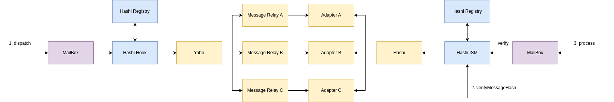

# hashi-ism

Hashi integration of [Hyperlane ISM](https://docs.hyperlane.xyz/docs/reference/ISM/specify-your-ISM)



Hyperlane Interchain Security Module (ISM) is part of the modular security provided by Hyperlane. Users can define their own ISM for their security preferences.

This is a PoC of Hashi as Hyperlane ISM. With Hashi as ISM, the security is guaranteed by the [Hashi Adapters](https://github.com/gnosis/hashi/tree/main/packages/evm/contracts/adapters).

## Workflow

### Prerequisite

Deployment of contracts

1. HashiRegistry: A registry for Hashi Adapters pair and their corresponding fee.
2. Hashi Hook: A [hook contract](https://docs.hyperlane.xyz/docs/reference/hooks/overview) deployed on source chain.
3. Hashi ISM: An [ISM contract](https://docs.hyperlane.xyz/docs/reference/ISM/specify-your-ISM) deployed on destination chain.

### Call

1. User calls `Mailbox.quoteDispatch()` to get the fee and call `Mailbox.dispatch()` with provided fee.
2. Mailbox calls `HashiHook._postDispatch()` to invoke cross-chain message passing.
3. Hashi calls source chain message relays to pass the message hash w.r.t message Id and the message hash is stored on destination chain adapters.
4. HashiISM owner calls `HashiISM.verifyMessageHash()`with matching [Hashi Message Id](https://github.com/gnosis/hashi/blob/main/packages/evm/contracts/Yaho.sol#L22) and [Hyperlane Message Id](https://github.com/hyperlane-xyz/hyperlane-monorepo/blob/main/solidity/contracts/libs/Message.sol#L59), source and destination domain as parameters.
5. User calls `Mailbox.process()` to check the execute the message.
6. Mailbox calls `HashiISM.verify()` to check whether the message has been verified by Hashi ISM.

## Dev

Install

```
npm install
```

Compile the contracts

```
npx hardhat compile
```

Test

```
npx hardhat test
```
